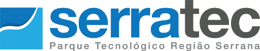
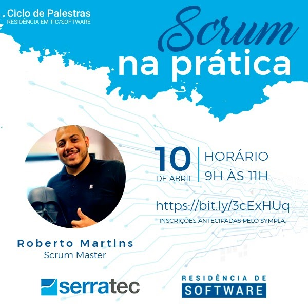
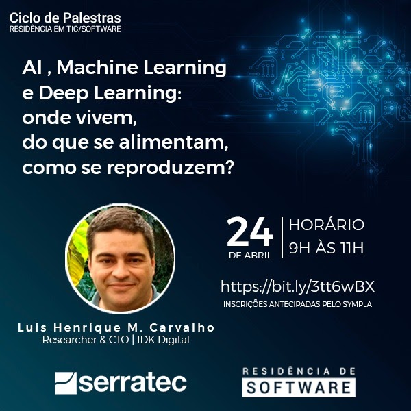
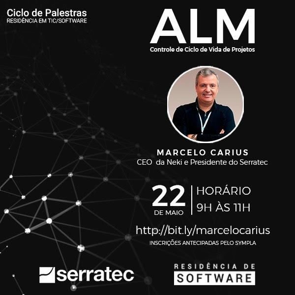
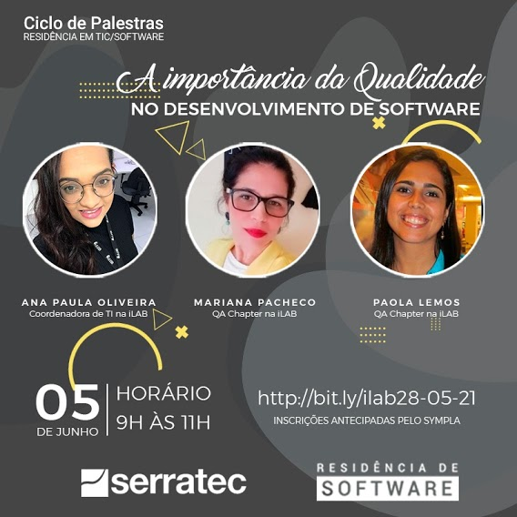
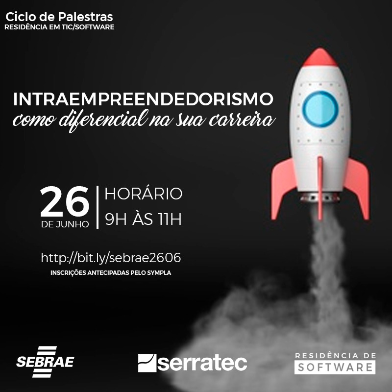
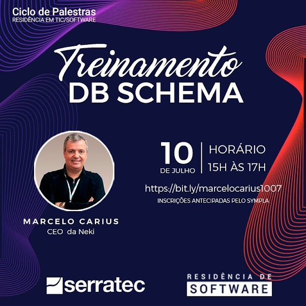

   &nbsp;&nbsp;&nbsp;&nbsp;&nbsp;&nbsp;&nbsp;&nbsp;&nbsp;&nbsp;&nbsp;&nbsp;&nbsp;&nbsp;&nbsp;&nbsp;&nbsp;&nbsp;&nbsp;&nbsp;&nbsp;&nbsp;&nbsp;&nbsp;&nbsp;&nbsp;&nbsp;&nbsp;&nbsp;&nbsp;&nbsp;&nbsp;&nbsp;&nbsp;&nbsp;&nbsp;&nbsp;&nbsp;&nbsp;&nbsp;&nbsp;&nbsp;&nbsp;&nbsp;&nbsp;&nbsp;&nbsp;&nbsp;&nbsp;&nbsp;&nbsp;&nbsp;&nbsp;&nbsp;&nbsp;&nbsp;&nbsp;&nbsp;&nbsp;&nbsp;&nbsp;&nbsp;&nbsp;&nbsp;&nbsp;&nbsp;&nbsp;&nbsp;&nbsp;&nbsp;&nbsp;

<h1 align="center">Palestras e Workshops</h1>
<h3 align="center">Ciclo de Palestras Residência em TIC/Software Serratec</h3>
 

##  Palestras

  
✔️ Scrum na Prática&nbsp;&nbsp;&nbsp;&nbsp;<i>(10/04/2021)</i>

    <h4>
      

        <b>Palestrante:</b>    Roberto Martins
          
          Roberto é graduado em Ciência da Computação e está se especializando em Arquitetura de Software. Tem 12 anos de experiência em tecnologia da informação. É Scrum Master, certificado pela Scrum.org e Scrum Alliance. Atuou como agilista na Stone e no fantasy game Cartola, da Globo. Faz parte do time da Alterdata, tendo atuado como Scrum Master, atualmente encara o desafio de liderar o time de programadores do Pack e Immobile.
         
      

  

    🎬<a href="https://www.youtube.com/watch?v=EpZfR_tlkp0&t=8039s" target="_blank">(Vídeo da Palestra)</a>&nbsp;&nbsp;    
    📚<a href="materialApresentado/scrumNaPratica">(Material Apresentado)</a>
  </h4>
  

  

    
  

 
  
✔️ Como atender a diversidade&nbsp;&nbsp;&nbsp;&nbsp;<i>(17/04/2021)</i>

    <h4>
      

        <b>Palestrante:</b>    Valmir de Souza
          
          Valmir é fundador do Instituto Biomob. Como atender a diversidade com o desenvolvimento de softwares. 
         
      

  

    🎬<a href="https://www.youtube.com/watch?v=h8pcq5HkXIs" target="_blank">(Vídeo da Palestra)</a>&nbsp;&nbsp;    
    📚<a href="materialApresentado/comoAtenderDiversidade">(Material Apresentado)</a>
  </h4>
  

  

    
  

 
  
✔️ AI, Machine Learning e Deep Learning&nbsp;&nbsp;&nbsp;&nbsp;<i>(24/04/2021)</i>

    <h4>
      

      <b>Palestrante:</b>    Luis Henrique Muniz de Carvalho
          
          Luis é Researcher & CTO na IDK Digital. Falará sobre AI, Machine Learning e Deep Learning,
          onde vivem, do que se alimentam, como se reproduzem.
         
      

  

    🎬<a href="https://youtu.be/LomAzSTLCQQ" target="_blank">(Vídeo da Palestra)</a>&nbsp;&nbsp;    
    📚<a href="materialApresentado/aiMachineLearningDeepLearning">(Material Apresentado)</a>&nbsp;&nbsp;
    🐍<a href="materialApresentado/aiMachineLearningDeepLearning/palestra_ai_ml_dl.py">(Código Python)</a>&nbsp;&nbsp;      
    
  </h4>
  

  

    
  

 
  
✔️ Conceitos de Business Intelligence&nbsp;&nbsp;&nbsp;&nbsp;<i>(08/05/2021)</i>

    <h4>
      

      <b>Palestrante:</b>    Frederick Souza
          
          Frederick, Tableau Specialist da Info4. Irá apresentar Conceitos de Business Intelligence.
         
      

  

  
    <a href="https://youtu.be/tbEIQTnRyEQ" target="_blank">(Vídeo da Palestra)</a>&nbsp;&nbsp;    
    <a href="materialApresentado/businessIntelligence">(Material Apresentado)</a>&nbsp;&nbsp;
  </h4>
  

  

    
  

 
  
✔️ Storytelling com Dados&nbsp;&nbsp;&nbsp;&nbsp;<i>(15/05/2021)</i>

    <h4>
      

      <b>Palestrante:</b>    Frederick Souza
          
          Frederick, Tableau Specialist da Info4. Irá apresentar Storytelling com Dados.
         
      

  

    🎬<a href="https://youtu.be/dsBkU4VAfy8" target="_blank">(Vídeo da Palestra)</a>&nbsp;&nbsp;    
    📚<a href="materialApresentado/businessIntelligence">(Material Apresentado)</a>&nbsp;&nbsp;
  </h4>
  

  

    
  

 
  
✔️ ALM - Controle de Ciclo de Vida de Projetos&nbsp;&nbsp;&nbsp;&nbsp;<i>(22/05/2021)</i>

    <h4>
      

      <b>Palestrante:</b>    Marcelo Carius
          
          Marcelo Carius, CEO da Neki e Presidente do Serratec. Irá apresentar Controle de Ciclo de Vida de Projetos.
         
      

  

    🎬<a href="https://youtu.be/yRDJWsufMaM" target="_blank">(Vídeo da Palestra)</a>&nbsp;&nbsp;    
    📚<a href="materialApresentado/aml">(Material Apresentado)</a>&nbsp;&nbsp;
  </h4>
  

  

    
  

 
  
✔️ Por que aprender a programar?&nbsp;&nbsp;&nbsp;&nbsp;<i>(29/05/2021)</i>

    <h4>
      

      <b>Palestrante:</b>    Helder da Rocha
          
          Helder da Rocha, programador Full Stack, professor, escritor, artista, engenheiro e tradutor. Irá apresentar Por que aprender a programar?
         
      

  

    🎬<a href="https://youtu.be/An8rREVO_GQ" target="_blank">(Vídeo da Palestra)</a>&nbsp;&nbsp;    
    📚<a href="materialApresentado/">(<s>Material Apresentado</s>)</a>&nbsp;&nbsp;
  </h4>
  

  

    
  

 
  
✔️ A importância da Qualidade no desenvolvimento de software?&nbsp;&nbsp;&nbsp;&nbsp;<i>(05/06/2021)</i>

    <h4>
      

      <b>Palestrante:</b>    Ana Paula Oliveira, Mariana Pacheco, Paola Lemos.
          
          Com Ana Paula Oliveira, coordenadora da de IT na iLAB, Mariana Pacheco, QA Chapter, e Paola Lemos, QA Chapter. Apresentaram A importância da Qualidade no desenvolvimento de software?
         
      

  

    🎬<a href="https://youtu.be/e_-s4xF1Ip8" target="_blank">(Vídeo da Palestra)</a>&nbsp;&nbsp;    
    📚<a href="materialApresentado/qualidadeDesenSoftware">(Material Apresentado)</a>&nbsp;&nbsp;
  </h4>
  

  

    
  

 
  
✔️ Carreira de Sucesso: desenvolva sua melhor versão.&nbsp;&nbsp;&nbsp;&nbsp;<i>(12/06/2021)</i>

    <h4>
      

      <b>Palestrante:</b>    Ladmir Carvalho.
          
          Com Ladmir Carvalho, Presidente e fundador da Alterdata Software. Irá apresentar Carreira de Sucesso: desenvolva sua melhor versão. 
         
      

  

    🎬<a href="https://youtu.be/g9nJeWyWUbU" target="_blank">(Vídeo da Palestra)</a>&nbsp;&nbsp;    
    📚<a href="materialApresentado/">(<s>Material Apresentado</s>)</a>&nbsp;&nbsp;
  </h4>
  

  

    
  

 
  
✔️ A importância da Qualidade no desenvolvimento de software?&nbsp;&nbsp;&nbsp;&nbsp;<i>(05/06/2021)</i>

    <h4>
      

      <b>Palestrante:</b>    Ana Paula Oliveira, Mariana Pacheco, Paola Lemos.
          
          Com Ana Paula Oliveira, coordenadora da de IT na iLAB, Mariana Pacheco, QA Chapter, e Paola Lemos, QA Chapter. Apresentaram A importância da Qualidade no desenvolvimento de software?
         
      

  

    🎬<a href="https://youtu.be/e_-s4xF1Ip8" target="_blank">(Vídeo da Palestra)</a>&nbsp;&nbsp;    
    📚<a href="materialApresentado/qualidadeDesenSoftware">(Material Apresentado)</a>&nbsp;&nbsp;
  </h4>
  

  

    
  

 
  
✔️ "Iot, IIot, IoE??? Internet of... ¯\_(ツ)_/".&nbsp;&nbsp;&nbsp;&nbsp;<i>(19/06/2021)</i>

    <h4>
      

      <b>Palestrante:</b>    Luis Henrique M. Carvalho.
          
          Luis Henrique M. Carvalho, Researcher e CTO da IDK Digital. Irá apresentar  "Iot, IIot, IoE??? Internet of... ¯\_(ツ)_/". 
         
      

  

    🎬<a href="https://youtu.be/92VMiNXFI-Q" target="_blank">(Vídeo da Palestra)</a>&nbsp;&nbsp;    
    📚<a href="materialApresentado/iot/iot.pdf">(Material Apresentado)</a>&nbsp;&nbsp;
  </h4>
  

  

    
  

 
  
✔️ Intraempreendedorismo como diferencial na sua carreira.&nbsp;&nbsp;&nbsp;&nbsp;<i>(26/06/2021)</i>

    <h4>
      

      <b>Palestrante:</b>    SEBRAE.
          
          SEBRAE. Irá apresentar  Intraempreendedorismo como diferencial na sua carreira. 
         
      

  

    🎬<a href="" target="_blank">(Vídeo da Palestra)</a>&nbsp;&nbsp;    
    📚<a href="materialApresentado/">(Material Apresentado)</a>&nbsp;&nbsp;
  </h4>
  

  

    
  

 
  
✔️ Os Princípios da Inovação: Como Empresas e Profissionais Inovadores estão se destacando na Nova Economia.&nbsp;&nbsp;&nbsp;&nbsp;<i>(03/07/2021)</i>

    <h4>
      

      <b>Palestrante:</b>    Rafael Fernandes.
          
          Rafael Fernandes, Analista de Inovação na Softex Nacional. Irá apresentar Os Princípios da Inovação: Como Empresas e Profissionais Inovadores estão se destacando na Nova Economia. 
         
      

  

    🎬<a href="https://youtu.be/AP4oo7OxJok" target="_blank">(Vídeo da Palestra)</a>&nbsp;&nbsp;    
    📚<a href="">(<s>Material Apresentado</s>)</a>&nbsp;&nbsp;
  </h4>
  

  

    
  

 
  
✔️ Treinamento DB Schema.&nbsp;&nbsp;&nbsp;&nbsp;<i>(10/07/2021)</i>

    <h4>
      

      <b>Palestrante:</b>    Marcelo Carius.
          
          Marcelo Carius, CEO da Neki. Irá apresentar Treinamento DB Schema. 
         
      

  

    🎬<a href="https://youtu.be/byCKKAGNxco" target="_blank">(Vídeo da Palestra)</a>&nbsp;&nbsp;    
    📚<a href=""><s>(Material Apresentado)</s></a>&nbsp;&nbsp;
  </h4>
  

  

    
  

*Totalizando 31h*

 
<!--
&emsp;&emsp;&emsp;&emsp;&emsp;&emsp;&emsp;&emsp;&emsp;&emsp;&emsp;&emsp;&emsp;&emsp;&emsp;&emsp;&emsp;&emsp;&emsp;&emsp;⬆️[**Back to top**](#back-to-top)⬆️
-->