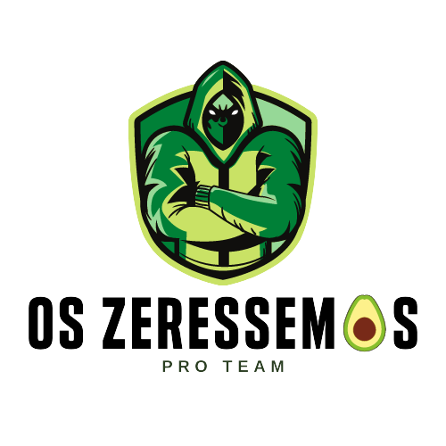
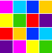

   &nbsp;&nbsp;&nbsp;&nbsp;&nbsp;&nbsp;&nbsp;&nbsp;&nbsp;&nbsp;&nbsp;&nbsp;&nbsp;&nbsp;&nbsp;&nbsp;&nbsp;&nbsp;&nbsp;&nbsp;&nbsp;&nbsp;&nbsp;&nbsp;&nbsp;&nbsp;&nbsp;&nbsp;&nbsp;&nbsp;&nbsp;&nbsp;&nbsp;&nbsp;&nbsp;&nbsp;&nbsp;&nbsp;&nbsp;&nbsp;&nbsp;&nbsp;&nbsp;&nbsp;&nbsp;&nbsp;&nbsp;&nbsp;&nbsp;&nbsp;&nbsp;&nbsp;&nbsp;&nbsp;&nbsp;&nbsp;&nbsp;&nbsp;&nbsp;&nbsp;&nbsp;&nbsp;&nbsp;&nbsp;&nbsp;&nbsp;&nbsp;&nbsp;&nbsp;&nbsp;&nbsp;

<h1 align="center">Programação Orientada a Objetos (Java)</h1>
<h3 align="center">Professor Marcelo Machado Collares</h3>

 

##  Conteúdo Programático

✔️ Compreender compilação, execução e entrada de dados (i/o, teclado, console). 
✔️ Dominar os identificadores, palavras chave, tipos e operadores (tipos primitivos, conversão,       variáveis, hierarquia de operadores e parênteses). 
✔️ Saber utilizar as estruturas de programação ( if , loop, switch, break, * Enum , métodos de classe, recursividade) e escopo de variáveis. 
✔️ Gerir objetos e classes: acesso, getters , setters , construtores, static. 
✔️ Gerir objetos e classes: herança, reescrita, polimorfismo, classes abstratas e Interfaces. 
✔️ Manipula r data e hora. 
✔️ Saber utilizar as estruturas de dados (arrays, coleções). 
✔️ Realizar o tratamento de erros. 
✔️ Acessar um banco de dados a partir do backend. 
✔️ Empacotar aplicações, criar e utilizar bibliotecas.

*Totalizando 84h*

 

##  Atividades

* [Material de Aula](materialDeAula/) 
* [Exercícios Variados](exerciciosVariados/) 
* [Projeto Banco (*Feito em aula*)](sistemaBancoFeitoEmAula/)
* [Projeto Sistema Faculdade](sistemaFaculdadeFuncionarios/) 
 
### ⚡Projeto Final     
 &nbsp;&nbsp;&nbsp;&nbsp;&nbsp;&nbsp;[**Sistema Banco (*Zeroth National Bank*)**](sistemaBancoAvaliacao/) 
  &nbsp;&nbsp;&nbsp;&nbsp;&nbsp;&nbsp;[*Enunciado*](sistemaBancoAvaliacao/documento/projetoFinalDisciplinaJava.pdf)     

##  Tecnologia Utilizada

- [**Eclipse**](https://www.eclipse.org/downloads/)    [*(Documentação)*](https://help.eclipse.org/2021-03/index.jsp)
- [**Oracle JDK**](https://www.oracle.com/br/java/technologies/javase-downloads.html)    [*(Documentação)*](https://docs.oracle.com/en/java/javase/16/)
  

   

<table>
  <tr>
    <td align="center">
      <a href="https://github.com/raiocodrigues">
         
        
          <b>Caio Rodrigues</b>
        
      </a>
    </td>
    <td align="center">
      <a href="https://github.com/FredericoStilpen">
         
        
          <b>Frederico Stilpen</b>
        
      </a> 
    </td>
    <td align="center">
      <a href="https://github.com/M4G1Ck">
         
        
          <b>Gabriel Macedo Araújoo</b>
        
      </a> 
    </td>
    <td align="center">
      <a href="https://github.com/JpBade">
         
        
          <b>João Paulo Bade</b>
        
      </a> 
    </td>
    <td align="center">
      <a href="https://github.com/marcosbarker">
         
        
          <b>Marcos Paulo Marques Corrêa</b>
        
      </a> 
    </td>
    <td align="center">
      <a href="https://github.com/Volneineves">
         
        
          <b>Volnei Neves</b>
        
      </a> 
    </td>
</table>