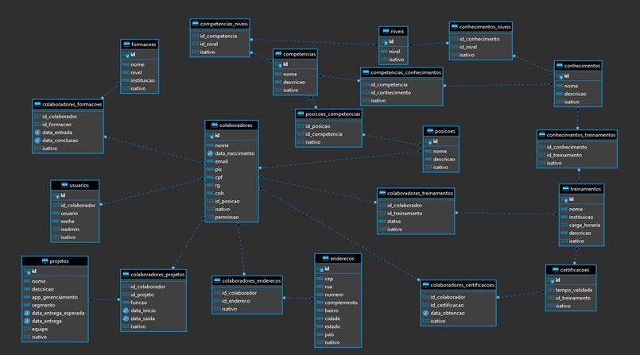

<a name="back-to-top">
<h5 align="center"><b><i>Projeto dos alunos da R-TIC/Software 2021.1 com a t2m</i></b></h5>

 &nbsp;&nbsp;&nbsp;&nbsp;&nbsp;&nbsp;&nbsp;&nbsp;&nbsp;&nbsp;

<h1 align="center">T2M TREINAMENTO API</h1>
 

<h2>Índice</h2>

- [🖊️Projeto](#️projeto)
- [⚡Backlog Priorizado](#backlog-priorizado)
- [⛏️Desenvolvimento API](#️desenvolvimento-api)
- [📈Diagrama E.R. Banco de Dados](#diagrama-er-banco-de-dados)
- [🍃Back End](#back-end)
- [📱Versão Mobile](#versão-mobile)
- [🌐Versão Web](#versão-web)
- [⚙️Repositórios de Desenvolvimento](#️repositórios-de-desenvolvimento)
- [📷Screenshots](#screenshots)
  - [Navegador](#navegador)
  - [Swagger](#swagger)
- [🚀Tecnologias Utilizadas](#tecnologias-utilizadas)
- [👩‍💻Desenvolvedores](#desenvolvedores)
- [👨‍🏫Monitores](#monitores)
- [👨‍💼Product Owner](#product-owner)
- [🧪Tester](#tester)
 
<a name="projeto">

## 🖊️Projeto
**Desenvolvimento de aplicação Web, Mobile e API que cumpra os seguintes requisitos:**
- Sistema de login para administradores e líderes de projetos.
- Líderes devem ser capazes de cadastrar novos líderes e colaboradores.
- Administradores devem ser capazes de cadastrar, além dos citados acima, novos administradores.
- Ambas as aplicações devem:
  - Listar os colaboradores da empresa, com informações específicas de cada um, bem como a posição que ocupam na empresa.
  - Disponibilizar uma série de treinamentos e pré-requisitos para ocupação de posições.
 

## ⚡Backlog Priorizado 
✔️ Eu como administrador desejo cadastrar colaboradores.  
✔️ Eu como administrador desejo cadastrar outros administradores e líderes e no sistema. 
✔️ Eu como líder desejo fazer o login. 
✔️ Eu como líder desejo cadastrar colaboradores. 
✔️ Eu como administrador desejo definir requisitos para ocupação de cada posição. 
✔️ Eu como administrador desejo inserir uma Lista de treinamentos para cada posição. 
✔️ Eu como líder desejo usar um mecanismo de busca de funcionários com filtros. 
 
<a name="desenvolvimento-api">

## ⛏️Desenvolvimento API
- Projeto desenvolvido em Spring Boot.
- Banco de dados PostgreSQL com uso no DBeaver.
- Equipe fixa de 3 desenvolvedores.
- Prazo em que foi desenvolvido 19/07/2021 até 06/08/2021.
- Deploy feito no Heroku, utilizando serviço EC2 AWS.
- Método com comando subtree utilizando Heroku CLI.  
- Sendo consumindo por T2M Treinamento Web e Mobile.
 

## 📈Diagrama E.R. Banco de Dados
- [Scripts do Banco de Dados](./scriptsDB/)

 

## 🍃Back End
- [API T2M Treinamento](https://api-treinamento-t2m.herokuapp.com/) 
- [Documentação Swagger](https://api-treinamento-t2m.herokuapp.com/swagger-ui/index.html)
 

## 📱Versão Mobile
- [Repositório](https://github.com/serratec/20211t2mTreinamentoMobile)
 

## 🌐Versão Web
- [Repositório](https://github.com/serratec/20211t2mtreinamentoFront)
 

## ⚙️Repositórios de Desenvolvimento
- [Organização](https://github.com/Serratec-T2M-Projeto-Treinamento)
- [API](https://github.com/Serratec-T2M-Projeto-Treinamento/treinamentoT2M-api)
- [Mobile](https://github.com/Serratec-T2M-Projeto-Treinamento/treinamentoT2M-mobile)
- [Web](https://github.com/Serratec-T2M-Projeto-Treinamento/treinamentoT2M-web)
 

## 📷Screenshots
### Navegador

### Swagger

 

## 🚀Tecnologias Utilizadas
- [**DBeaver**](https://dbeaver.io/)    [(*Documentação*)](https://dbeaver.com/docs/wiki/)
- [**Heroku**](https://www.heroku.com/)    [(*Documentação*)](https://devcenter.heroku.com/categories/reference)
- [**Java**](https://www.oracle.com/java/technologies/)    [(*Documentação*)](https://docs.oracle.com/en/java/)    [(*Documentação MDN*)](https://developer.mozilla.org/en-US/docs/Glossary/Java)
- [**Maven**](https://maven.apache.org/)    [(*Documentação*)](https://maven.apache.org/maven-features.html)
- [**PostgreSQL**](https://www.postgresql.org/)    [(*Documentação*)](http://pgdocptbr.sourceforge.net/pg80/index.html)
- [**Postman**](https://www.postman.com/downloads/)    [(*Documentação*)](https://learning.postman.com/docs/getting-started/introduction/)
- [**Spring Boot**](https://spring.io/)    [(*Documentação*)](https://spring.io/projects/spring-boot)
- [**Spring Tools 4**](https://spring.io/tools)    [(*Documentação*)](https://github.com/spring-projects/sts4/wiki)      
- [**Spring Quickstart Guide**](https://spring.io/quickstart)    [(*Documentação*)](https://spring.io/guides)
- [**Swagger**](https://swagger.io/)    [(*Documentação*)](https://swagger.io/solutions/api-documentation/)   
 
<h1 align="center">🤝Contribuidores</h1> 

## 👩‍💻Desenvolvedores
<table>
  <tr>
    <td align="center">
      <a href="https://github.com/Anna-Luiza">
         
        
          <b>Anna Luiza Barillo</b>
        
      </a>
    </td>
    <td align="center">
      <a href="https://github.com/Diogo-Mendes-Martins">
         
        
          <b>Diogo Mendes Martins</b>
        
      </a> 
    </td>
    <td align="center">
      <a href="https://github.com/ianalt">
         
        
          <b>Ian Alt</b>
        
      </a> 
    </td>
    <td align="center">
      <a href="https://github.com/isis-la">
         
        
          <b>Isis Soares</b>
        
      </a> 
    </td>
    <td align="center">
      <a href="https://github.com/joaogarantesf">
         
        
          <b>João Guilherme Arantes Freitas</b>
        
      </a> 
    </td>
    <td align="center">
      <a href="https://github.com/JpBade">
         
        
          <b>João Paulo Bade</b>
        
      </a> 
    </td>
  </tr>
</table>
  <table>
  <tr>
    <td align="center">
      <a href="https://github.com/marcosbarker">
         
        
        <b>Marcos Paulo Marques Corrêa</b>
        
      </a> 
    </td>
    <td align="center">
      <a href="https://github.com/MatheusJRM">
         
        
          <b>Matheus José Ribeiro de Moura</b>
        
      </a> 
    </td>
    <td align="center">
      <a href="https://github.com/ThiagoLino311">
         
        
          <b>Thiago Lino</b>
        
      </a> 
    </td>
  </tr>
</table>

## 👨‍🏫Monitores
<table>
  <tr>
    <td align="center">
      <a href="https://github.com/AbJoia">
         
        
          <b>Abner Joia</b>
        
      </a>
    </td>
    <td align="center">
      <a href="https://github.com/bernardpiccoli">
         
        
          <b>Bernard Piccoli</b>
        
      </a> 
    </td>
    <td align="center">
      <a href="https://github.com/caina-machado">
         
        
          <b>Cainã Machado</b>
        
      </a> 
    </td>
  </tr>
</table>

## 👨‍💼Product Owner
<table>
  <tr>
    <td align="center">
      <a href="https://www.linkedin.com/in/erik-menas-584b541b4/">
         
        
          <b>Erik Menas</b>
        
      </a>
    </td>
</table>

## 🧪Tester
<table>
  <tr>
    <td align="center">
      <a href="https://www.linkedin.com/in/victor-vieira-0081a720a/">
         
        
          <b>Victor Vieira</b>
        
      </a>
    </td>
</table>

&emsp;&emsp;&emsp;&emsp;&emsp;&emsp;&emsp;&emsp;&emsp;&emsp;&emsp;&emsp;&emsp;&emsp;&emsp;&emsp;&emsp;&emsp;&emsp;&emsp;⬆️[**Back to top**](#back-to-top)⬆️
