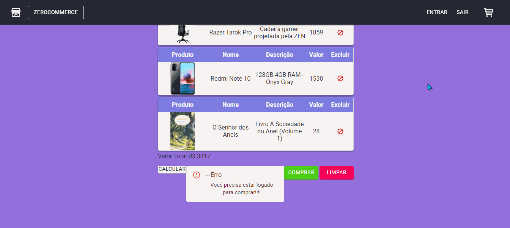
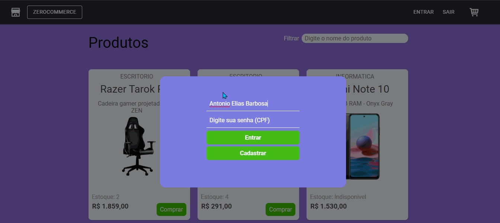

<i><h6>Projeto feito pelo grupo Zeréssimos como requisito parcial da disciplina Desenvolvimento Web, da Residência de Software do Serratec.</h6></i>

<!-- ALL-CONTRIBUTORS-BADGE:START - Do not remove or modify this section -->
<!---->
<!-- ALL-CONTRIBUTORS-BADGE:END -->
  

    <h3  align="center">
    Compre, compre e compre mais um pouco, aqui na ZeressemosCompany você encontra os melhores produtos das piores marcas.
    </h3>
  

  

    <h2 align="center">
    Só a Zero te satisfaz e te leva pra trás.
    </h2>
  
 
   

&nbsp;

  

## 🛍️    Projeto Final
&nbsp;&nbsp;&nbsp;&nbsp;&nbsp;&nbsp;**ZEROCOMMERCE**    [*(Enunciado)*](./public/assets/readme/enunciadoProjetoFinal.pdf)
 * [**Site**](https://zerocommerce-web.herokuapp.com/)

#### Usuários teste
* Cliente:
  - email: ester@email.com
  - senha(CPF): 60530582031
* Funcionário:
  - nome: Antonio Elias Barbosa
  - senha(CPF): 88955429088
###### *Para outros usuários e funcionários, consultar API.* 

## 🍃    API Consumida
 * [**ZeroCommerceAPI**](https://api-zerocommerce.herokuapp.com/)    (*Usar endpoint*)
 * [**Documentação Swagger**](https://api-zerocommerce.herokuapp.com/swagger-ui.html)

##     Tecnologia Utilizada
- [**Axios**](https://www.npmjs.com/package/react-axios)    [(*Documentação*)](https://www.npmjs.com/package/react-axios)
- [**CSS**](https://www.w3.org/Style/CSS/)    [(*Documentação MDN*)](https://developer.mozilla.org/en-US/docs/Web/CSS/Reference)
- [**HTML5**](https://html.spec.whatwg.org/)    [(*Documentação MDN*)](https://developer.mozilla.org/pt-BR/docs/Web/HTML)
- [**JavaScript**](https://www.javascript.com/)    [(*Documentação MDN*)](https://developer.mozilla.org/pt-BR/docs/Web/JavaScript)
- [**npm**](https://www.npmjs.com/)    [(*Documentação*)](https://docs.npmjs.com/)
- [**React**](https://pt-br.reactjs.org/)    [*(Documentação)*](https://pt-br.reactjs.org/docs/getting-started.html)    [(*Documentação MDN*)](https://developer.mozilla.org/pt-BR/docs/Learn/Tools_and_testing/Client-side_JavaScript_frameworks/React_getting_started)
- [**TypeScript**](https://www.typescriptlang.org/)    [*(Documentação)*](https://www.typescriptlang.org/docs/)
- [**Visual Studio Code**](https://code.visualstudio.com/)    [*(Documentação)*](https://code.visualstudio.com/docs)
  

© 2021 Copyright: zeressemos.com

Sambando na cara das inimigas desde 2021

 

   

## Contributors ✨
Thanks goes to these wonderful people ([emoji key](https://allcontributors.org/docs/en/emoji-key)):

<!-- ALL-CONTRIBUTORS-LIST:START - Do not remove or modify this section -->
<!-- prettier-ignore-start -->
<!-- markdownlint-disable -->
<table>
  <tr>
    <td align="center"><a href="http://linktr.ee/marcos_barker"> <b>Marcos Paulo Marques Corrêa </b></a> <a href="https://github.com/OsZeressemos/zeroCommerce/issues?q=author%3Amarcosbarker" title="Bug reports">🐛</a> <a href="https://github.com/OsZeressemos/zeroCommerce/commits?author=marcosbarker" title="Code">💻</a> <a href="https://github.com/OsZeressemos/zeroCommerce/commits?author=marcosbarker" title="Documentation">📖</a> <a href="#tool-marcosbarker" title="Tools">🔧</a> <a href="#infra-marcosbarker" title="Infrastructure (Hosting, Build-Tools, etc)">🚇</a> <a href="#userTesting-marcosbarker" title="User Testing">📓</a></td>
    <td align="center"><a href="https://www.linkedin.com/in/gabriel-macedo-ara%C3%BAjo-951603165/"> <b>Gabriel Macedo Araújo</b></a> <a href="https://github.com/OsZeressemos/zeroCommerce/commits?author=M4G1Ck" title="Code">💻</a> <a href="#design-M4G1Ck" title="Design">🎨</a> <a href="#ideas-M4G1Ck" title="Ideas, Planning, & Feedback">🤔</a> <a href="#maintenance-M4G1Ck" title="Maintenance">🚧</a> <a href="https://github.com/OsZeressemos/zeroCommerce/commits?author=M4G1Ck" title="Tests">⚠️</a></td>
    <td align="center"><a href="https://github.com/raiocodrigues"> <b>Caio Rodrigues</b></a> <a href="https://github.com/OsZeressemos/zeroCommerce/commits?author=raiocodrigues" title="Code">💻</a> <a href="#a11y-raiocodrigues" title="Accessibility">️️️️♿️</a> <a href="#data-raiocodrigues" title="Data">🔣</a></td>
    <td align="center"><a href="https://github.com/FredericoStilpen"> <b>FredericoStilpen</b></a> <a href="https://github.com/OsZeressemos/zeroCommerce/commits?author=FredericoStilpen" title="Code">💻</a> <a href="https://github.com/OsZeressemos/zeroCommerce/commits?author=FredericoStilpen" title="Documentation">📖</a> <a href="#example-FredericoStilpen" title="Examples">💡</a> <a href="https://github.com/OsZeressemos/zeroCommerce/commits?author=FredericoStilpen" title="Tests">⚠️</a> <a href="#tutorial-FredericoStilpen" title="Tutorials">✅</a> <a href="#ideas-FredericoStilpen" title="Ideas, Planning, & Feedback">🤔</a></td>
    <td align="center"><a href="https://github.com/JpBade"> <b>João Paulo Bade</b></a> <a href="https://github.com/OsZeressemos/zeroCommerce/commits?author=JpBade" title="Code">💻</a> <a href="#ideas-JpBade" title="Ideas, Planning, & Feedback">🤔</a> <a href="#example-JpBade" title="Examples">💡</a> <a href="#mentoring-JpBade" title="Mentoring">🧑‍🏫</a></td>
    <td align="center"><a href="http://linktr.ee/volneineves"> <b>Volnei Neves</b></a> <a href="https://github.com/OsZeressemos/zeroCommerce/issues?q=author%3AVolneineves" title="Bug reports">🐛</a> <a href="https://github.com/OsZeressemos/zeroCommerce/commits?author=Volneineves" title="Code">💻</a> <a href="#content-Volneineves" title="Content">🖋</a> <a href="https://github.com/OsZeressemos/zeroCommerce/commits?author=Volneineves" title="Documentation">📖</a> <a href="#projectManagement-Volneineves" title="Project Management">📆</a></td>
  </tr>
</table>

<!-- markdownlint-restore -->
<!-- prettier-ignore-end -->

<!-- ALL-CONTRIBUTORS-LIST:END -->

This project follows the [all-contributors](https://github.com/all-contributors/all-contributors) specification. Contributions of any kind welcome!
